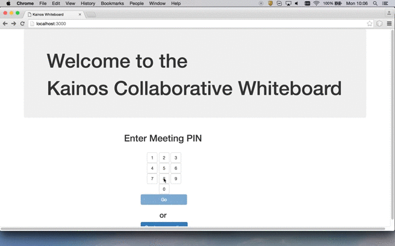
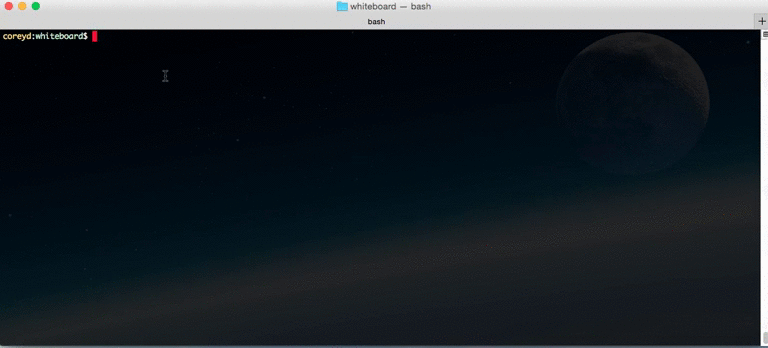
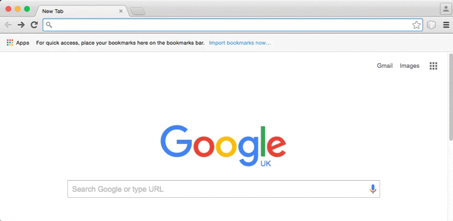

# Whiteboard

Whiteboard was initially created by Michael Kemp, a Kainos Software Engineer, for his final year university project. To try out a configuration of the Whiteboard project please visit: https://kainoswhiteboard.herokuapp.com/ 

The goal of Whiteboard is to allow people to collaborate on projects through its whiteboard functionality and use of real time communication. Using webRTC it allows for in-browser video conferencing and its whiteboard feature allows any participant in the call to effectively plan or communicate their ideas through drawing sketches and diagrams that can be moved, rotated and deleted as needed. It aims to improve the way teams work together across multiple geographical locations.



For more information, please visit this website: http://kainossoftwareltd.github.io/Whiteboard/  

#Getting Started
##Online Access
To access a sample configuration of the Kainos Collaborative Whiteboard project through your browser, go to the following link: https://kainoswhiteboard.herokuapp.com/ 

In order to customise the contacts you can add/invite you will need to install the project locally and enable the invite feature (this feature is initially disabled). 

Once it has been installed locally, you will be able to push your own configuration to Heroku. This will allow you to use your own XirSys account, SMTP server and will allow you to add new contacts to the “Create New Meeting” screen should you choose to enable it. 

##Local Installation
###Prerequisites
You will need to download:
* Node.js version 0.10.25

The installer for this can be found here: https://nodejs.org/en/blog/release/v0.10.25/
* Npm version 3.3.10

Installation instructions for this can be found here: https://www.versioneye.com/nodejs/npm/3.3.10

###Installing
1. In Terminal/Command Line run: git clone https://github.com/KainosSoftwareLtd/Whiteboard.git 
2. In the whiteboard folder run npm install to download all required dependencies.
3. Change directory to the bin folder and run node www

4. You now can access the site at http://localhost:3000/


#Configuration

##XirSys
This project requires you to create a XirSys account in order to allow you to communicate with other computers on internal networks. XirSys provides the STUN and TURN servers needed to make this possible. An account can be created via their website:
https://xirsys.com/ 

Once you have created an account you will need to enter the following details to the “user.json” file in the format outlined below:

```javascript
{
   "form": 
    {
         "ident": "<UserName>",
         "secret": "<API_Authentication_Key>",
         "domain": "<YourDomain>",
         "application": "<YourApplication>",
         "room": "<YourRoom>",
         "secure": 1
    },
    "json": true
}
```
####NOTE
This project also provides functionality whereby an email can be sent to notify someone of a planned online meeting however for now this has been disabled for the initial configuration of the project. If you would like to enable this feature please see the "**Invite Functionality**" section below.

#Testing
To run associated tests Karma must be installed. To do this follow the instructions on the [Karma website](https://karma-runner.github.io/1.0/index.html). 

Run karma `start karma.conf.js` from the whiteboard folder in terminal. Test output will be displayed in the terminal.

####NOTE
If you wish to enable the invite functionality then alterations to some tests will need to be made. Please see the **Testing Invite Functionality** section below for more details.

#Connecting Another Computer To Localhost
Once you have whiteboard running on your local machine, others will be able to join meetings that you host. To do this they must enter the IP address of your machine into their web browser in the following format:

`http://IPADDRESS:3000`

From here the user will be able to enter a meeting room pin or they can directly connect to a meeting by entering ammending their browser URL to the following:

`http://IPADDRESS:3000/board/ROOMPIN`

NOTE: Some browsers (such as the latest version of Google Chrome) may prevent access to a computer's camera and microphone and thus prevent real-time communication. If this is the case please follow the instructions below to utilise ngrok in order to bypass this issue.

##Ngrok
This project makes use of webRTC, allowing a camera and microphone to be accessed through your browser. Some browsers will therefore want to ensure that information is handled securely. 

Ngrok helps provide this security by enabling you to "instantly create a public HTTPS URL for a web site running locally on your development machine."

This will allow you to bypass security issues with modern versions of browsers such as Google Chrome by allowing you to connect to a HTTPS URL, which is viewed as secure. To begin please download ngrok from the site found [here](https://ngrok.com/) and save the zip file to your "whiteboard" folder

Next you will need to unzip the downloaded file. If you are using a Windows machine please double click ngrok.zip. To do this on Linux or OSX please run the following command in terminal:
`unzip /path/to/ngrok.zip`

In order to then create a public HTTPS URL please run the following command `./ngrok http 3000`

If you have the project running in another terminal window i.e. by running the `node www` command, your configuration of the whiteboard project will then be accessible on a URL similar to the following example: https://08ff56sd.ngrok.io


#Pushing to Heroku
Once you are happy with your whiteboard configuration it may be useful to push it to Heroku to make it easier to access. By pushing your configuration to Heroku you will be able to access your specific Whiteboard setup from any device that is connected to the internet.

To do this you will need to create a free Heroku account. This can be done [here](https://signup.heroku.com/dc).

Once your free account is set up you will be able to push your code to a personal app by following the instructions found [here](https://devcenter.heroku.com/articles/git). You will then be able to access your site at 
https://YOURDOMAINNAME.herokuapp.com


#Invite Functionality
Currently access to the invite functionality has been disabled. In order to enable access to the "Create New Meeting" page you will need to delete the comments surrounding the "Create New Meeting" button in index.hbs (Whiteboard/views/index.hbs).

To do this, please navigate to index.hbs and identify the following code:
```javascript
               <!--<div class="row">
                    <div class="text-center col-xs-12">
                        <h3>or</h3>
                        <br>
                    </div>
                </div>

                <div class="row">
                    <div class="col-xs-offset-4">
                        <button type="button" ng-click="newMeeting()" class="btn btn-primary">Create new meeting</button>
                    </div>
                </div>-->
```
Then delete the comment tags surrounding the code so that it looks like this:
```javascript
               <div class="row">
                    <div class="text-center col-xs-12">
                        <h3>or</h3>
                        <br>
                    </div>
                </div>

                <div class="row">
                    <div class="col-xs-offset-4">
                        <button type="button" ng-click="newMeeting()" class="btn btn-primary">Create new meeting</button>
                    </div>
                </div>
```
This will enable the "Create New Meeting" button on the main page of the project.

##SMTP
This project also provides invite functionality by allowing you to invite contacts to a meeting room via email. In order to avail of this functionality you will need to add an SMTP (Simple Mail Transfer Protocol) server in order to facilitate the email transfer.
A gmail account provides an SMTP server. This will need to be added to the invite.js file (whiteboard/routes/invite.js) as shown below:
```javascript
var transporter = nodemailer.createTransport('smtps://<YourDomain>%40gmail.com:<YourPassword>@smtp.gmail.com');
```

##Adding New Contacts
Currently displaying people that are available to invite is handled as part of InviteCtrl.js (whiteboard/public/js/controllers/InviteCtrl.js) as shown below:

```javascript
{
   id: 1,
   userImage: ***REMOVED***
   name: Test Name,
   department: 'Test Department',
   email: 'testdepartment@kainos.com'
},
```
In order to add people to invite for this meeting their details will need to be added to this file in the appropriate format and each person must have a unique id. Therefore, if I wanted to add a second potential invitee I would add:
```javascript
{
    id: 1,
    userImage: ***REMOVED***
    name: Test Name,
    department: 'Test Department',
    email: 'testdepartment@kainos.com'
},	

{
    id: 2,
    userImage: ***REMOVED***
    name: Test Name2,
    department: 'Test Department2',
    email: 'testdepartment2@kainos.com'
},
```

###Testing Invite Functionality
If you have added your own contacts then you will also need to edit InviteCtrlTests.js (whiteboard/test/unit/InviteCtrlTests.js).

You will need to edit the data stored in `var mockTableTestData` by replacing any existing contacts with the contacts you have added.
The information must be entered in the following format and must match the information you have added to InviteCtrl.js:
```javascript
[
 {
    id: 1,
    userImage: ***REMOVED***
    name: Test Name,
    department: 'Test Department',
    email: 'testdepartment@kainos.com'
 },	

 {
    id: 2,
    userImage: ***REMOVED***
    name: Test Name2,
    department: 'Test Department2',
    email: 'testdepartment2@kainos.com'
 }
];
```
You will also need to remove the comment block enclosing one of the tests in InviteCtrlTests.js (Whiteboard/test/unit/InviteCtrlTests.js) 
To do this please navigate to InviteCtrlTests.js and identify the following code:
```javascript
        /*it('$scope.removeUserFromInviteesList() should remove the specified user from the invitee list and add them ' +
            'back to the table', function(){
            $scope.addUserToInviteesList = mockTableTestData[1];

            $scope.removeUserFromInviteesList(mockTableTestData[1]);

            expect($scope.invitees).not.toContain(mockTableTestData[1]);
            expect($scope.mockTableData).toContain(mockTableTestData[1]);
        });*/
```
Then remove the comment markers so that the code looks like this:
```javascript
      it('$scope.removeUserFromInviteesList() should remove the specified user from the invitee list and add them ' +
            'back to the table', function(){
            $scope.addUserToInviteesList = mockTableTestData[1];

            $scope.removeUserFromInviteesList(mockTableTestData[1]);

            expect($scope.invitees).not.toContain(mockTableTestData[1]);
            expect($scope.mockTableData).toContain(mockTableTestData[1]);
        });
```
This will enable another test in the suite and provide greater test coverage for the project's invite functionality.

#Q&A
**Q: What browsers are supported?**

**A:** Currently most browsers except for Safari support WebRTC to some capacity. More in-depth details can be found here, http://iswebrtcreadyyet.com/ 

**Q: How many connections can there be to any one meeting?**

**A:** Four users/connections can access a room at any one time

**Q: Are there any costs associated with a XirSys account?**

**A:** This depends on the plan you choose. XirSys offer a free plan which provides 100MB, 10 concurrent TURN connections and unlimited STUN usage.


#Built With
*	Angular JS
*	Fabric.js
*	Node.js
*	EasyRTC

#Authors
* **Michael Kemp** – Initial creator of the project.
* **Corey Duffy** – Making project open source and minor bug fixes.

#License
This project is licensed under the MIT License – please see the LICENSE file for details.
